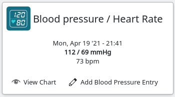
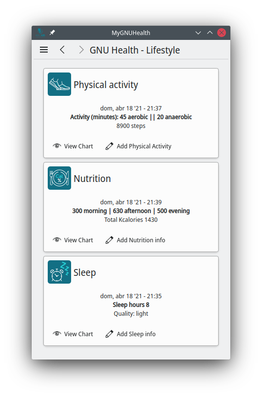
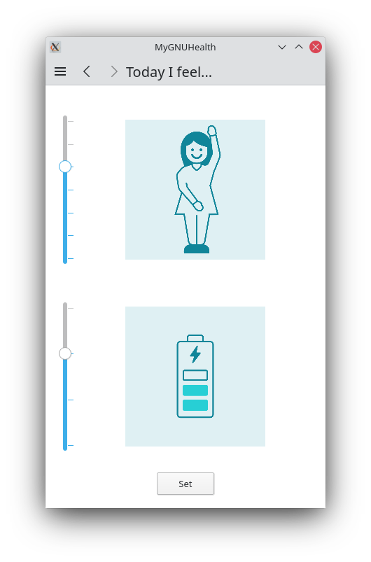

===============
 |MyGNUHealth|
===============

.. Note:: This document is licensed under Creative Commons 
    Attribution-ShareAlike 4.0 International (CC BY-SA 4.0) 

.. contents::

MyGNUHealth is the GNU Health **Personal Health Record**. This application can
be run in desktops and mobile devices.

The GNU Health Personal Health Record 
=====================================

Introduction
============
MyGNUHealth is a desktop and mobile application that helps you to take 
control of your health. As a Personal Health Record, you will be able to assess, 
record and take action upon the determinants of the main health spheres 
(bio-psycho-social).

MyGNUHealth will be your health companion. You will be able to connect with your
health professionals, and share the health data you wish to share with them in
real time.

MyGNUHealth puts you in the driver's seat, as an active member of the system of
health.

The need of a Libre Personal Health Record
------------------------------------------
A Personal Health Record must respect the freedom and privacy of the individual.

There are Personal Health Record applications in the market, but MyGNUHealth is
unique. MyGNUHealth is a Libre program respects your freedom and privacy. By
Libre we mean that the source code of the application is available; the user can
modify it if she wishes, and interact with the community to improve the application.
You are in control of the application. Unlike other closed-source health applications,
you can rest assured that your health information won't be leaked or sold to anyone.

MyGNUHealth is part of the GNU Health ecosystem (https://www.gnuhealth.org),
a project that uses state-of-the-art technology to deliver Social Medicine, equity,
freedom and privacy in healthcare.

MyGNUHealth is licensed under the **GNU General Public License v3+**. It is Libre,
and it will remain Libre.

Downloading and installing the application
==========================================

MyGNUHealth will be available from different sources. Check if your operating
system already has the MyGNUHealth package.

MyGNUHealth depends on both Kirigami2 and PySide2 to be installed at a system
level, and will not properly work otherwise.
Using the system's package manager will be enough to install those dependencies
keeping in mind the required versions on the system:

* PySide2 5.15+
* Python 3.6+

After installing those dependencies on the system,
you can install MyGNUHealth via pip::

 $ pip install --user --upgrade MyGNUHealth

(Keep in mind some systems might have `pip3` instead of `pip`)

Using MyGNUHealth
=================

Starting up the application
---------------------------
|InitialScreen|

Click or tap into the MyGNUHealth icon on your mobile device or desktop.
You will be presented with the welcoming screen.

Profile initialization
----------------------
The very first time MyGNUHealth is run, you need to enter very basic information
about yourself. The date of birth, height and sex are the main parameters to 
be included. They are used in medical contexts, so is important that you 
fill them in. In this step, you will also set up your **personal key**

|ProfileInitialization|

The button to create the profile will activate when the following requirements
are met:
* The height value is set
* The personal key is 4 characters or longer
* The personal key is entered twice correctly

Navigation
----------
MyGNUHealth uses a "stack" navigation model. That is, when you enter a
page, you move forward, and do a "push" operation on it. The opposite 
also applies. When moving backwards, you do a "pop" operation on the
current page, and move back one level.

Signing into MyGNUHealth
-------------------------
|LoginScreen|

The main screen
---------------
|MainScreen|

Once you sign in, you are presented to the MyGNUHealth main screen, with the 
main components:

* **Health Tracker**: This section records quantifiable events,
    from the biological, lifestyle and psychological domains.
     
* **Book of Life**: The book of life is your personal health diary, made of 
    *Pages of Life*. From the genetic and molecular components to the social 
    events throughout your life that make you a unique individual.

.. note:: The main screen components and layout might change from one release
    to another.

The Menu (Drawer)
-----------------
|Menu| 

You will find the main menu on the upper left corner. 
The main entries are:

* Profile Settings: Updates your user information and 
* Network Settings: Tests the connection to the GNU Health Federation
* Logout: Sign out from MyGNUHealth and takes you to the initial screen.
* About page: Displays the **version** and credits.

|MenuActive|

Most of the items, except the "About" entry can only be accesible once 
you have logged into the application. Inactive entries are in grey.

Once you signed it, all the menu entries are enabled, as you can see from the
previous image.

Profile Settings
~~~~~~~~~~~~~~~~
In the profile settings page you can set or update the information related to
your height, Federation account (if you have one) and update your personal
key (password).

|ProfileSettings|

It's important that you set your **height**. It will be used to calculate your
current Body Mass Index (BMI) any time you enter your weight in the health
tracker.

The height is shown in centimeters, so "178" corresponds to "1.78 m"

The **Federation account** is a unique ID that identifies you within a 
*GNU Health Federation* . If your country, province or health professional are
part of the GNU Health Federation, then you can share information with them
in real time.
The GNU Health Federation is revolutionary. It connects individuals with their
health professionals, health institutions, laboratories, research institutions,
social services and other entities related to the system of health.

Network Settings (Federation)
~~~~~~~~~~~~~~~~~~~~~~~~~~~~~
MyGNUHealth can work in an autonomous way, that is, without sharing information, or
integrated in the **GNU Health Federation**.
If you choose to integrate yourself with the system of health and your healthcare
professionals, then MyGNUHealth will be able to share the information that with them.

|NetworkSettings|

Your health center will provide you with all the required information to integrate to
the GNU Health Federation. The information required is:

* Thalamus server Information : protocol, server name and port
* Federation Account: An account that uniquely identifies you in the Federation.
* Account password
* Enable Federation Synchronization (optional): If you set this option, you will
    be able to push the pages of life to the GNU Health Federation.

Once you have entered all the information, you can test the network and credentials by
pressing the "Test connection" button.

.. list-table::

    * - |ConnectionOK|
        Connection test OK
      - |InvalidCredentials|
        Wrong Credentials
      - |ConnectionError|
        Network Error

.. Note:: The user name (Federation account) and the password are not stored. They just
    serve as a way to test the connection to Thalamus. If you have a definitive federation
    account, you can store in on your user profile.

Once you are ready, you can press the "Update" button to save the network information.

Logout
~~~~~~

The logout action closes all the pages, signs you out from MyGNUHealth and takes you to the
initial screen.

The About page
~~~~~~~~~~~~~~
The about page gives you license information, credits and the **version**.
Knowing the version is important so you can report issues or know the latest functionality.

|About|

The Health Tracker
==================
As we mentioned in the introduction, MyGNUHealth has two main sections, the Health tracker
and the book of life.

The Health Tracker currently has three main blocks:

* Bio: This section focuses on monitoring common physiological and
  anthropometric parameters of medical importance, such as blood pressure, heart rate, glucose level or weight.
* Lifestyle: The section covers basic lifesytle patterns. Eating habits and calorie intake,
  sleep and physical activity.
* Psychological assessment: A basic self-assessment of mood and energy levels.

   Workflow from the main PHR page to the Blood pressure history

   When you are using MyGNUHealth desktop client, you can resize the application, so the
   you can have two or three pages on the same screen. In this example, clicking on
   the "Health Tracker" section, it will show the three main areas (Bio, lifestyle and
   pyschological assessment). If you select the bio section, MyGNUHealth will present
   the contexts (Blood pressure, glucose level...) that make up the "Bio" page.

.. Note:: In upcoming versions, MyGNUHealth will support for smartwatches, such as the
    *PineTime*, glucometers, oximeters and other devices that are open hardware and use
    open protocols.

Health tracker cards
--------------------

The different contexts within the health tracker are encapsulated into items called
"cards". The layout and contents of the cards contain a descriptive icon, a title and the
last reading (date and values). In the lower corners of the cards there are two icons, one
for the **chart** and in the lower right corner one to **add** a new entry.

|BloodPressureCard|

All health tracker cards share the same layout.

Bio / clinical assessment
-------------------------

* Blood pressure
* Heart rate: The heart frequency is recorded in the same card as the blood pressure, since
  many BP monitors measure both parameters.
* Blood glucose level (mg/dL)
* Weight: The Unit of measure is in kilograms
* Hemoglobin (Hb) oxygen saturation (Osat)

.. Note:: You can take as many measures as you need during the day. It is normal for
    some parameters to be taken several times during the day, like in the case of glucose. However, there are some parameters that usually are taken once a day (i.e., weight).

Lifestyle
---------

|LifeStyleSummary|

* Physical Activity

 * Steps
 * Aerobic and anaerobic activity (minutes)

* Nutrition: Total Kcal per day divided in morning, afternoon and night.
* Sleep: Records the number of hours and quality of the sleep.

Psychological self assessment
-----------------------------
MyGNUHealth allows you to keep a log of your **mood and energy levels**, either on a daily basis or different times during a day.
Keeping track of how you feel about your mood and energy provides a great deal of
information to your health professional.

Please also provide your **sleep** patterns (see lifestyle section) that complements this
mood and energy tracker.

The mood and energy meters
~~~~~~~~~~~~~~~~~~~~~~~~~~
The mood and enery meters are *sliders* situated on the left side of the page. In oder to
register a new entry, you need to activate (click on the slider) and set the current level.

On the center of the page, there are two emoticons, that change depending on the mood and
energy levels.

|MoodEnergyAssessment|

**Mood levels**: The mood level has the **[-3:3] range**. Frequent values on the extremes
(extremely happy (+3) or extremely sad (-3)) could be associated to mood disorders.

**Energy level**: The energy level is represented by the battery emoticon, and the interval
has a **range from 0 to 3** [0:3]. Zero being exhausted and 3 supercharged. As in the the case of
mood levels, frequent values on the extreme might be a warning sign of a mood disorder or
other medical condition.

.. Note:: It is your **health professional** who will make the best reading out of this and
    other logs from MyGNUHealth. Please consult with her. She will be able to **interpret**
    the recordings in a much broader context, with your help and other domains and readings
    from MyGNUHealth.

A note on charts
----------------
MyGNUHealth, thanks to the excellent *mathplotlib* package, has the ability to automatically
set the x axis (time) value. You will notice, specially when there are few records, that the
x-axis will show values in the unit of hours (time of the day) and days. That is the expected
behaviour.

The Book of Life
================

Domains and contexts
--------------------

Medical domain
--------------

The Medical Genetics context
~~~~~~~~~~~~~~~~~~~~~~~~~~~~

Social Domain
-------------

Lifesytle domain
----------------

Biographical Information
------------------------

